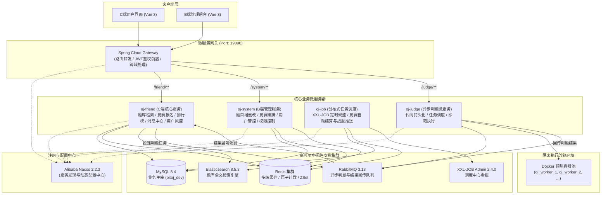

# 比特OJ 在线代码评测平台（后端服务）

<p align="center">
  <strong>基于 Spring Cloud Alibaba + Java 17 的企业级微服务分布式在线代码评测平台</strong>
</p>

<p align="center">
  
  
  
  
  
  
  
  
</p>

---

## 📖 项目简介

**比特OJ（Online OJ）** 是一套面向高校算法教学、企业技术选拔及算法爱好者的**高可用、高并发、安全隔离**的现代化分布式在线代码评测系统。

项目后端采用主流的 **Spring Boot 3.0 + Spring Cloud Alibaba 2022** 微服务架构，核心业务涵盖题库检索、代码在线提交判题、算法竞赛对抗、实时排行榜生成、站内消息实时触达与用户风控安全拦截等。针对传统 OJ 系统判题冷启动慢、系统调用存在安全隐患等痛点，自研了基于 **Docker 预热容器池化沙箱** 与 **RabbitMQ 异步削峰** 的高性能判题引擎。

---

## 🏛️ 系统架构拓扑

系统遵循领域驱动与微服务边界规范，各服务独立演进、依赖显式、契约解耦：



---

## 📦 模块分层与工程结构

工程严格贯彻单向依赖原则，公共极薄库不承载具体业务，内部服务间仅依赖 `oj_api` 契约包：

```text
online_oj/
├── deploy/                          # 容器化编排与初始化脚本
│   ├── docker-compose.yml           # 一键拉起全套中间件 (MySQL, Redis, Nacos, MQ, ES, XXL-JOB)
│   ├── db_sql/                      # 核心基线与业务增量 SQL 脚本
│   │   ├── int.sql                  # 基础系统表与 Nacos 数据库结构
│   │   ├── tables_message.sql       # 站内信消息正文与用户投递表
│   │   ├── tables_user_exam.sql     # 竞赛报名与得分排名记录表
│   │   ├── tables_user_submit.sql   # 用户提交记录表
│   │   └── tables_xxl_job.sql       # XXL-JOB 调度引擎库表
│   └── dev/                         # 中间件插件配置 (Elasticsearch, Kibana)
├── oj_api/                          # 跨服务公共契约包 (DTO / VO / MQ 常量，可被外部服务引用)
├── oj_common/                       # 极薄底层技术支撑库 (禁止依赖业务模块)
│   ├── oj_common_core/              # 统一响应封装 (OJResult, TableDataResult)、通用枚举与常量
│   ├── oj_common_security/          # JWT 认证解析、TokenService、ThreadLocal 上下文与安全拦截器
│   ├── oj_common_redis/             # RedisTemplate 二次封装 (RedisService)、对象与列表缓存工具
│   ├── oj_common_mybatis/           # MyBatis-Plus Lambda 配置、分页拦截器与元数据自动填充
│   ├── oj_common_elastic/           # Elasticsearch 8.x 索引操作与文档同步客户端
│   ├── oj_common_message/           # 阿里云短信发送 SDK 封装
│   ├── oj_common_swagger/           # OpenAPI 3 / Knife4j 接口文档集成
│   └── oj_gateway/                  # Spring Cloud Gateway 统一微服务网关 (Port: 19090)
└── oj_modules/                      # 核心业务领域微服务
    ├── oj_system/                   # B端后台管理系统服务 (题目管理、竞赛发布、用户管控)
    ├── oj_friend/                   # C端核心用户服务 (题库、答题提交、竞赛中心、排行榜、消息中心)
    ├── oj_judge/                    # 独立安全判题引擎 (Docker 预热容器池、隔离沙箱、编译评测)
    └── oj_job/                      # 分布式调度服务 (XXL-JOB 定时规整、竞赛排名结算与战报推送)
```

---

## 🌟 核心特色与技术亮点

### 1. 独创的 Docker 预热容器池化沙箱
* **痛点解决**：传统 OJ 评测每道提交时执行 `docker run` 带来明显的容器冷启动耗时（单次冷启可达 1.5s - 2.5s），高并发竞赛期间系统负载急剧升高。
* **池化技术实现**：`oj_judge` 模块引入 `DockerContainerPool` 机制，系统启动时自动预热并常驻一组轻量级运行沙箱容器（如 `oj_worker_1`、`oj_worker_2` 等）。
* **极速编译执行**：判题任务到达后将代码 `docker cp` 进空闲 Worker 的私有目录，直接通过 `docker exec` 编译执行，结束后清理进程与目录再归还，将容器启动时间压缩至 **接近 0ms**，单次判题平均耗时优化至 **100ms** 级别。
* **多维安全防护**：对沙箱容器实施严格限额限制（Memory Limit, CPU Limit）、关闭特权模式、隔离网络访问，防止恶意死循环、Fork 炸弹及未经授权的宿主机系统调用。

### 2. RabbitMQ 异步削峰与最终一致性评测
* 用户在工作台提交代码后，系统毫秒级生成处于评测中状态的提交记录，将任务打包写入 `judge.task.queue` 消息队列，工作台前端即可开启轮询，用户体验丝滑流畅；
* `oj_judge` 判题引擎按配置并发拉取任务，在沙箱内完成编译、测试用例多组比对（比对标准输出与用例期望）；
* 判题完成后通过 `judge.result.queue` 回传评测结果（AC / WA / TLE / MLE / CE / RE 等状态及执行时间和内存消耗），`oj_friend` 异步监听并最终落库更新。

### 3. Redis 双层架构站内消息中心
* **正文缓存解耦（String 缓存）**：`m:d:{textId}` 存储通用或特定消息详情 JSON（默认 7 天 TTL），同一系统公告可被百万用户复用，避免数据库频繁 Join 联表与回表；
* **用户消息队列（List 缓存）**：`u:m:l:{userId}` 维护当前用户接收的最新 100 条消息 ID 队列，通过 `LPUSH` + `LTRIM` 高效截断与分页；
* **原子未读数计数（Atomic Increment）**：`u:m:unread:{userId}` 支持新消息到达时原子自增、单条标为已读时原子自减与一键已读直接置零，前台小铃铛角标读取性能达数十万 QPS。

### 4. 竞赛实时榜单与多级同分仲裁引擎
* **算分规则**：支持多题累加制，每道题目取选手在竞赛周期内的最高单次提交得分；
* **四重同分裁决算法（Tie-Breakers）**：
  $$\text{总分降序} \longrightarrow \text{AC通过题数降序} \longrightarrow \text{最后一次有效提交时间升序} \longrightarrow \text{报名时间升序}$$
* **动静分区缓存**：未完赛竞赛使用短 TTL（3 分钟）快速缓存保证动态刷新，已完赛榜单建立 24 小时长效缓存并写入 `tb_user_exam` 的 `exam_rank` 归档。
* **自动化定时战报**：集成 XXL-JOB 每天凌晨调度 `examRankSettlementHandler`，计算前一天完赛竞赛结果，自动生成个性化战报并推送至所有参赛选手消息中心。

### 5. 全链路身份穿透与 AOP 用户拉黑风控
* 用户请求经由 `oj_gateway` 校验合法性后，解析出 `userId` 与 `userKey`，通过全局请求头传递至下游微服务；
* 下游服务通过 `ThreadLocalUtil` 在线程上下文中隐式获取身份，杜绝信任前端入参带来的越权安全隐患；
* 核心受保护操作（提交代码、报名比赛、修改资料等）标记 `@CheckUserStatus` 注解，通过 `UserStatusCheckAspect` 切面统一前置判定用户封禁拉黑状态，一处生效、全平台拦截。

---

## 🛠️ 技术栈清单

| 类别 | 技术选型 | 版本 | 用途说明 |
| :--- | :--- | :--- | :--- |
| **基础语言环境** | Java (Eclipse Temurin) | 17 LTS | 新一代企业级 LTS 运行环境 |
| **微服务框架** | Spring Boot | 3.0.1 | 核心工程底座 |
| **微服务治理** | Spring Cloud & Alibaba | 2022.0.0 / 2022.0.0.0-RC2 | 微服务套件与全家桶支持 |
| **注册与配置中心** | Alibaba Nacos | 2.2.3 | 服务注册发现与配置动态下发 |
| **微服务网关** | Spring Cloud Gateway | 4.0.1 | 统一入口分发、鉴权与限流 |
| **持久层技术** | MyBatis-Plus | 3.5.5 | Lambda 链式查询、自动分页与 CRUD 增强 |
| **数据库** | MySQL | 8.4 LTS | 核心结构化数据存储 (InnoDB) |
| **分布式缓存** | Redis | 7.x | 多级缓存、原子计数、排行榜 |
| **消息中间件** | RabbitMQ | 3.13 | 异步判题任务解耦与削峰填谷 |
| **搜索引擎** | Elasticsearch & Kibana | 8.5.3 | 题库全文字符匹配与多维筛选高亮 |
| **定时调度** | XXL-JOB | 2.4.0 | 分布式定时规整与竞赛自动化结算 |
| **虚拟化沙箱** | Docker & Docker Java Client | Engine 26+ | 容器隔离代码安全执行环境 |
| **安全认证** | JJWT (Java JWT) | 0.9.1 | 无状态分布式登录凭据签发与校验 |
| **通用工具包** | Hutool / Fastjson2 / Lombok | 5.8.22 / 2.0.43 | 高效集合处理、快速 JSON 编解码 |
| **接口文档** | SpringDoc / OpenAPI 3 | 2.2.0 | 在线交互式 API 契约文档与调试看板 |

---

## 🚀 快速启动指南

### 1. 本地前置环境准备
确保本地安装并就绪如下基础组件：
* **JDK 17**（配置好 `JAVA_HOME` 环境变量）
* **Maven 3.8+**
* **Docker Desktop**（已开启守护进程，支持本地 API 调用）
* **Node.js 18+**（若需调试前台 Vue 工程）

### 2. 启动基础支撑中间件（Docker Compose）
仓库根目录下提供了完备的中间件编排脚本，进入 `deploy` 目录：
```powershell
cd deploy
docker compose up -d
```
> [!NOTE]
> 该命令将自动拉起 MySQL 8.4、Redis、Nacos 2.2.3、RabbitMQ 3.13、Elasticsearch 8.5.3、Kibana 以及 XXL-JOB Admin 调度控制台。初次拉起约需 1-2 分钟完成健康检查。

### 3. 检查数据库与中间件端口映射
* **MySQL 8.4**：`127.0.0.1:3308`（账号：`root`，密码：`123456789`，主业务库：`bitoj_dev`）
* **Redis**：`127.0.0.1:6379`（密码：`123456`）
* **Nacos 控制台**：`http://127.0.0.1:8848/nacos`（账号/密码：`nacos`/`nacos`，默认命名空间 ID：`8f599ee1-85ee-45b3-8435-1522e90fb2e0`）
* **RabbitMQ 控制台**：`http://127.0.0.1:15672`（账号/密码：`admin`/`123456`）
* **XXL-JOB 调度中心**：`http://127.0.0.1:18080/xxl-job-admin`（账号/密码：`admin`/`123456`）

### 4. 编译与打包后端工程
在项目根目录下通过 Maven 统一安装公共库与契约依赖：
```powershell
mvn clean install -DskipTests
```

### 5. 微服务启动顺序推荐
使用 IntelliJ IDEA 打开项目，按顺序依次启动各个 Spring Boot 模块主程序：
1. **`oj_gateway`**（网关路由入口，端口 `19090`）
   * 主类：`cn.nuonuoya.gateway.GatewayApplication`
2. **`oj_system`**（管理后台业务服务）
   * 主类：`cn.nuonuoya.system.SystemApplication`
3. **`oj_friend`**（C端用户与竞赛服务）
   * 主类：`cn.nuonuoya.friend.FriendApplication`
4. **`oj_judge`**（沙箱判题服务）
   * 主类：`cn.nuonuoya.judge.JudgeApplication`
5. **`oj_job`**（分布式定时任务处理器，可选）
   * 主类：`cn.nuonuoya.job.JobApplication`

---

## 📡 核心 API 路由总览

通过统一网关（`http://127.0.0.1:19090`）访问各微服务，主要功能路由如下：

### 1. C端用户与竞赛接口 (`/friend/**`)
* `POST /friend/user/send-code`、`POST /friend/user/login`：短信验证码登录（新用户自动注册）
* `GET|PUT /friend/user/profile`、`POST /friend/user/avatar`：个人资料与头像
* `GET  /friend/user/profile/overview`、`GET /friend/user/profile/calendar`：做题统计、能力雷达与解题日历
* `GET  /friend/question`：题库分页检索（关键字、难度）
* `GET  /friend/question/{questionId}`：单题详情与公开示例
* `GET  /friend/question/{questionId}/neighbors`：上一题、下一题导航（可带 `examId`）
* `GET  /friend/question/first`、`GET /friend/question/stats`：首题与题库统计
* `POST /friend/question/{questionId}/run`：同步运行公开示例（不落库）
* `POST /friend/question/{questionId}/submissions`：提交代码并异步判题
* `GET  /friend/question/{questionId}/submissions`：本人本题提交记录分页
* `GET  /friend/question/submissions/{submitId}`：查询单次提交的判题结果
* `GET  /friend/exam`：竞赛列表（`type` 为 0 未完赛、1 历史竞赛）
* `GET  /friend/exam/{examId}`：竞赛详情
* `POST /friend/exam/{examId}/enrollment`：报名竞赛
* `GET  /friend/exam/mine`：我报名的竞赛
* `GET  /friend/exam/{examId}/rank`：竞赛排名（竞赛结束后公布）
* `GET  /friend/message`、`GET /friend/message/unread-count`：站内消息与未读数
* `PUT  /friend/message/{messageId}/read`、`PUT /friend/message/read/all`：标记已读

### 2. B端管理系统接口 (`/system/**`)
* `POST /system/sysUser/login`、`DELETE /system/sysUser/logout`、`GET /system/sysUser/me`：管理员登录、退出与当前信息
* `POST /system/sysUser`、`DELETE /system/sysUser/{userId}`：新增、删除管理员
* `GET|POST /system/question`、`GET|PUT|DELETE /system/question/{questionId}`：题目管理
* `GET|POST /system/exam`、`GET|PUT|DELETE /system/exam/{examId}`：竞赛管理
* `PUT|DELETE /system/exam/{examId}/publish`：发布、撤销发布竞赛
* `GET|POST /system/exam/{examId}/questions`、`DELETE /system/exam/{examId}/questions/{questionId}`：竞赛题目编排
* `GET  /system/user`、`PUT /system/user/{userId}`、`PUT /system/user/{userId}/status`：C端用户列表、资料编辑（手机号唯一）与拉黑解禁

### 3. 服务间内部接口 (`/{domain}/internal/**`，网关屏蔽)
* `POST /judge/internal/run`：friend 同步运行示例
* `POST /friend/internal/user/{userId}/cache/evict`：system 修改用户状态后清除缓存
* `POST /friend/internal/question/refresh`：system 题目变更后刷新题目缓存与 ES
* `POST /friend/internal/exam/cache/refresh`：system 竞赛变更后、job 定时刷新竞赛缓存
* `POST /friend/internal/exam/rank/settle`：job 定时结算已结束竞赛

---

## 🛡️ 代码规范与工程约束

项目严格遵循业界主流开发约束与架构纪律：
* **分层边界**：调用链严格遵从 `Controller → Service → Mapper`，禁止跨层或在 Controller 注入 Mapper。
* **参数与返回值**：Controller 统一使用 DTO 接参、返回统一 VO，禁止直接向前端暴露持久层 Entity。
* **MyBatis-Plus 约束**：持久层一律采用 Lambda API（如 `LambdaQueryWrapper` / `LambdaUpdateWrapper`），禁止硬编码数据库列名字段。
* **对象转换**：Entity 到 VO 的映射转换统一在 `converter` 包手写静态转换方法，避免动态反射开销。
* **注释风格**：
  * 类、接口、枚举声明统一采用 `// 中文单行` 注释；
  * Controller 接口方法统一采用 `/** 中文一句话 */` 单行 Javadoc 说明，不编写冗余的 `@param` / `@return`；
  * 核心关键业务算法上方编写简洁的单行步骤注解。
* **事务控制**：所有涉及数据修改的写操作统一标注 `@Transactional(rollbackFor = Exception.class)`。

---

## 📄 开源许可证

本项目基于 [MIT License](LICENSE) 协议开源，欢迎学习交流与二次开发。
