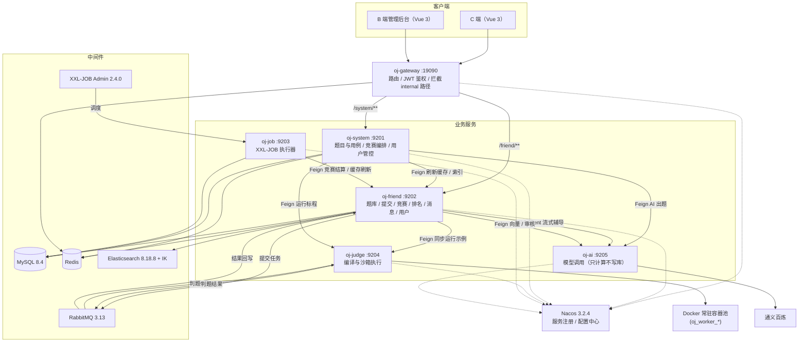

# 墨衡 OJ 在线判题平台（后端）

基于 Spring Cloud Alibaba 的微服务在线判题平台，覆盖刷题、竞赛与后台出题管理。

---

## 项目简介

**墨衡 OJ** 是一套微服务架构的在线判题平台：C 端提供题库检索、在线编码运行与提交、竞赛报名与排名、站内消息；B 端提供题目与测试用例管理、竞赛编排、用户管控。

判题由独立的 `oj_judge` 服务完成，基于自研的 **Docker 常驻容器池沙箱**；提交走 **RabbitMQ 异步判题**，示例运行走 Feign 同步调用。`oj_ai` 服务经 Spring AI Alibaba 接入通义大模型，提供 B 端 AI 辅助出题与 AI 帮建竞赛、C 端 AI 做题辅导、题目语义检索与相似题推荐、用户资料内容审核。

---

## 系统架构



- 前端只经网关访问 friend 与 system；judge、job、ai 不对外暴露，AI 能力由 friend / system 转发并负责权限与次数。
- 服务间调用走"provider 契约 + 调用方本地 Feign 客户端"：契约放 `oj_api`，调用方在自己的 `client` 包中实现 Feign 与降级；内部接口统一为 `/{domain}/internal/**`，网关拒绝外部访问。
- 题目 ES 索引、竞赛缓存等只由 friend 维护；system、job 修改数据后通过内部接口通知 friend 刷新。

---

## 工程结构

```text
online_oj/
├── deploy/                          # 本地编排与初始化脚本
│   ├── docker-compose.yml           # MySQL、Redis、Nacos、RabbitMQ、ES、Kibana、XXL-JOB Admin、Zipkin
│   ├── .env.example                 # compose 所需密钥模板（复制为 .env，不入库）
│   ├── db_sql/oj_init.sql           # 业务库表结构 + 测试数据 + XXL-JOB 库（MySQL 首次启动自动执行，可重复执行）
│   ├── nacos/nacos_v3_init.sql      # Nacos 3.x 配置库表结构（在业务库脚本之后自动执行）
│   ├── nacos/config/                # 各服务的 Nacos 配置模板（密钥引用 OJ_ 环境变量，不含真实值）
│   ├── docs/                        # 模型价格等参考资料
│   └── dev/                         # ES（IK 插件与自定义词典）、Kibana 配置
├── oj_api/                          # 跨服务契约：内部接口、DTO / VO、MQ 常量、契约枚举
├── oj_common/                       # 技术公共库（不含业务归属）
│   ├── oj_common_core/              # 统一响应、异常、工具类、ThreadLocal 上下文
│   ├── oj_common_security/          # JWT、TokenService、令牌拦截器
│   ├── oj_common_redis/             # RedisService 封装
│   ├── oj_common_mybatis/           # MyBatis-Plus 配置与自动填充
│   ├── oj_common_elastic/           # ES 客户端配置与题目文档
│   ├── oj_common_sentinel/          # Sentinel 依赖、调用保护工具与 YAML 规则转换器
│   ├── oj_common_message/           # 阿里云短信
│   ├── oj_common_swagger/           # springdoc-openapi
│   └── oj_gateway/                  # Spring Cloud Gateway（端口 19090）
└── oj_modules/                      # 业务服务
    ├── oj_friend/                   # C 端服务
    ├── oj_system/                   # B 端服务
    ├── oj_judge/                    # 判题服务
    ├── oj_job/                      # 定时任务执行器
    └── oj_ai/                       # AI 服务（Spring AI Alibaba，只做模型计算）
```

---

## 技术亮点

### 1. Docker 常驻容器池判题沙箱
- 启动时预热一组常驻容器（默认 3 个），判题时借出、用完归还，省掉每次 `docker run` 的冷启动。
- 每次评测用 `docker cp` 把代码拷进容器私有目录，不挂载宿主机目录，容器之间不共享文件。
- 全部用例经标准输入一次性喂入，只编译一次、只启动一次 JVM，输出逐行比对；程序中途异常时，从首行起连续匹配的行视为通过，据此定位首个失败用例。
- 容器断网（`--network none`）、进程数上限 64、内存 256 MB（swap 同值）、1 个 CPU；输出由独立线程读取并设上限，超出判为输出超限。
- 超时或清理失败的容器直接淘汰并补位；服务重启时清理上次残留的容器。

### 2. RabbitMQ 异步判题
- 提交时先写入"评测中"的提交记录，再把任务投递到判题队列，前端轮询结果。
- judge 消费任务并在沙箱中执行，结果经结果队列回传，friend 监听后回写提交记录。
- "运行示例"不落库，friend 通过 Feign 同步调用 `/judge/internal/run`。

### 3. 竞赛排名与只执行一次的结算
- 排名规则：总分降序 → 通过题数降序 → 最后提交时间升序 → 用户 ID 升序；每题取选手最高分。
- 排名缓存分两档：进行中 3 分钟、已结束 24 小时；查看排名只读不写库。
- XXL-JOB 调度 job 服务调用 friend 的结算接口：先用条件更新抢占"已结算"标记，任务重叠或重试也只结算一次；每场独立事务，战报的未读计数在事务提交后才写入 Redis。

### 4. 题目搜索与降级
- 题目搜索走 ES，标题与描述使用 IK 分词（含自定义算法词典）；关键词无结果时，首页用题目向量做 kNN 语义推荐（按相似度阈值过滤无关结果），同一份向量也用于相似题推荐。
- 题目向量随索引同步生成，文本未变化的题目复用已有向量；friend 启动后会在后台同步一次。
- 索引为空时自动从数据库全量同步；后台改题后同步并清掉已删除的题目；ES 不可用时直接查 MySQL，搜索不中断。

### 5. AI 能力（oj_ai，只计算不写库）
- B 端：AI 出题（题面草稿）、AI 生成用例（模型只出输入，预期输出由解法在判题沙箱实跑得到）、AI 解法示例；AI 帮建竞赛：模型理解描述 → friend 向量 + 关键词混合检索候选 → 模型按难度配比挑题 → system 校验、补齐并由易到难回填表单。
- C 端：做题辅导对话（SSE 流式、每日次数、竞赛中禁用、只给思路不给完整代码）、语义检索与相似题推荐、昵称 / 个人介绍 / 头像同步审核（审核服务不可用时放行）。
- 模型调用失败时 oj_ai 返回非 2xx，调用方在本地 client 转换为明确的业务错误码，不伪造结果。

### 6. 链路追踪
- Micrometer Tracing + Brave 上报 Zipkin：网关、各服务的 HTTP 入口、Feign 调用、friend 调 oj_ai 的流式 WebClient、RabbitMQ 发送与监听都自动传播追踪头，一次提交在 Zipkin 中是一条完整链路：网关 → friend → MQ → judge → MQ → friend。
- 日志带 `traceId` / `spanId`，拿 Zipkin 里的 traceId 可以直接在各服务日志中检索同一次请求。
- 采样率与 Zipkin 地址放在所有服务共用的 Nacos 配置 `oj-common-local.yaml`，本地全量采样。

### 7. 熔断限流（Sentinel）
- 只加在调用方 `client` 包的跨服务同步调用上，不统计全部 Web 接口、不做网关限流、不部署控制台（已去掉 8719 端口上无鉴权的规则读写接口）；规则以 YAML 写在 Nacos，由 `oj_common_sentinel` 的转换器解析，改规则不用重启。
- 被限流或熔断时沿用各调用边界原有的失败语义，不伪造成功：

| 资源 | 调用 | 规则（初始值，按链路追踪实测耗时调整） | 被拦截时 |
| :--- | :--- | :--- | :--- |
| `friend-judge-run` | friend 运行示例 → judge | 并发 10；慢调用（> 5s）过半熔断 10s | 返回系统错误结果"判题服务繁忙" |
| `friend-ai-tutor` | friend AI 辅导流 → oj_ai | 并发流 20；异常过半熔断 30s（AI 返回的错误事件也计入） | 推送错误事件"AI 服务繁忙"并归还次数 |
| `friend-ai-embedding` | friend 向量计算 → oj_ai | 慢调用（> 3s）过半熔断 30s | 按没有向量处理，只走关键词检索 |
| `friend-ai-moderation` | friend 资料审核 → oj_ai | 慢调用（> 5s）过半熔断 30s | 放行并记录告警（与审核服务不可用一致） |
| `system-ai` | system AI 出题 / 帮建 → oj_ai | 并发 5；异常过半熔断 60s | 返回 3401"AI 服务繁忙" |
| `system-judge-run` | system 运行标程 → judge | 并发 5；慢调用（> 10s）过半熔断 30s | 返回"判题服务暂不可用" |

- 熔断需在统计窗口内至少 5 次调用（system 为 3 次）才会判断；并发数按同时在途的调用计，同一瞬间涌入的请求可能一起通过，这是 Sentinel 先检查后计数的特性。

### 8. 身份透传与用户状态拦截
- 网关校验令牌后，先移除外部传入的身份头，再写入 `userId` / `userKey` 传给下游，防止伪造身份。
- 下游经拦截器放入 `ThreadLocal`，业务只从上下文取身份，不信任前端传入的用户 ID。
- 提交代码、报名竞赛等受保护操作标注 `@CheckUserStatus`，由切面统一拦截被拉黑用户。
- 会话存于 Redis 并滑动续期；C 端支持主动退出登录使会话失效。

---

## 技术栈

| 类别 | 技术 | 版本 |
| :--- | :--- | :--- |
| 语言 | Java | 17 |
| 框架 | Spring Boot | 3.5.16 |
| 微服务 | Spring Cloud / Spring Cloud Alibaba | 2025.0.3 / 2025.0.0.0 |
| 注册与配置 | Nacos（客户端 3.0.3） | 3.2.4 |
| 网关 | Spring Cloud Gateway（WebFlux） | 4.3.5 |
| 服务调用 | OpenFeign + LoadBalancer | 随 Spring Cloud |
| 持久层 | MyBatis-Plus / PageHelper | 3.5.17 / 2.1.1 |
| 数据库 | MySQL | 8.4 |
| 缓存 | Redis | latest |
| 消息队列 | RabbitMQ | 3.13 |
| 搜索 | Elasticsearch + IK 分词 / Kibana | 8.18.8 |
| 定时调度 | XXL-JOB | 2.4.0 |
| 链路追踪 | Micrometer Tracing + Brave / Zipkin | 1.5.12 / 3 |
| 熔断限流 | Sentinel（Nacos 规则数据源） | 1.8.9 |
| 判题沙箱 | Docker（CLI 调用，常驻容器池） | — |
| 认证 | JJWT + Redis 会话 | 0.9.1 |
| 接口文档 | springdoc-openapi | 2.8.17 |
| 工具 | Hutool / Fastjson2 / Lombok | 5.8.22 / 2.0.43 / 随 Boot |
| AI | Spring AI Alibaba（通义百炼：qwen3.7-max / qwen3.7-flash / text-embedding-v4） | 1.1.2.3 |

---

## 快速启动

### 1. 环境准备
- JDK 17、Maven 3.8+、Docker Desktop、Node.js 18+（调试前端时）。

### 2. 启动中间件
```powershell
cd deploy
copy .env.example .env   # 首次部署：填写 OJ_NACOS_AUTH_* 等密钥
docker compose up -d
```

> [!NOTE]
> - MySQL 数据卷首次创建时自动执行 `db_sql/oj_init.sql`（业务库 `bitoj_dev`、测试数据、调度库 `xxl_job`）和 `nacos/nacos_v3_init.sql`（Nacos 配置库 `bitoj_nacos_v3`）；已有数据卷不会重复执行，需要时手动执行，脚本可重复执行且不覆盖已有数据。
> - 测试数据：15 道题（简单 6 / 中等 5 / 困难 4，用例的预期输出由参考解实跑得到）、5 场竞赛（时间以初始化时刻为基准：已结算、已结束待结算、进行中、未开始、未发布各一场）、8 个用户、提交记录与站内消息。管理端账号 `admin / 123456`，用户端手机号 `13800000001` ~ `13800000007`（`13800000008` 为拉黑账号），XXL-JOB 调度中心 `admin / 123456`。
> - IK 分词插件需与 ES 同版本（8.18.8），放在 `deploy/dev/elasticSearch/es-plugins/ik`；jar 包不入库，从 INFINI Labs 发布页下载后解压到该目录，保留其中的 `config/` 词典。
> - compose 与各服务读取的环境变量都带 `OJ_` 前缀，避免与本机其他项目的 `NACOS_*` 变量冲突。

### 3. 本地端口

| 组件 | 地址 | 说明 |
| :--- | :--- | :--- |
| MySQL | `127.0.0.1:3308` | 业务库 `bitoj_dev`，Nacos 配置库 `bitoj_nacos_v3` |
| Redis | `127.0.0.1:6379` | |
| Nacos | `127.0.0.1:8848` / `9848` | 控制台 `http://127.0.0.1:18848`，首次打开设置管理员密码；命名空间 `8f599ee1-85ee-45b3-8435-1522e90fb2e0` |
| RabbitMQ | `127.0.0.1:5672` | 控制台 `http://127.0.0.1:15672` |
| Elasticsearch | `127.0.0.1:9200` | Kibana `http://127.0.0.1:15601` |
| Zipkin | `http://127.0.0.1:9411` | 调用链查询（内存存储，重启后清空） |
| XXL-JOB Admin | `http://127.0.0.1:18080/xxl-job-admin` | 初始化脚本已登记执行器 `oj-job-executor` 与两个任务（刷新竞赛列表、结算排名） |

各组件账号密码见 `docker-compose.yml` 与 `deploy/.env`。

### 4. 配置说明
- 各服务的 `application.yml` 只保留启动必需项：应用名、profile、Nacos 地址与命名空间（`OJ_NACOS_SERVER_ADDR`、`OJ_NACOS_NAMESPACE`，未设置时用本地默认值）以及 `spring.config.import`。
- 其余配置（数据库、Redis、MQ、ES、JWT 密钥、OSS、短信、网关路由与白名单、判题参数等）都在 Nacos，模板在 `deploy/nacos/config/`：在 Nacos 控制台新建 ID 为 `8f599ee1-85ee-45b3-8435-1522e90fb2e0` 的命名空间（或自建后设置 `OJ_NACOS_NAMESPACE`），按文件名创建同名 Data ID（Group `DEFAULT_GROUP`，格式 YAML）并粘贴内容：

| Data ID | 使用方 |
| :--- | :--- |
| `oj-common-local.yaml` | 所有服务最先导入的公共配置（链路追踪、Sentinel 规则数据源），可被各服务自己的 Data ID 覆盖 |
| `oj-friend-sentinel-flow.yaml`、`oj-friend-sentinel-degrade.yaml` | friend 的限流、熔断规则（YAML 列表，模板内有字段说明） |
| `oj-system-sentinel-flow.yaml`、`oj-system-sentinel-degrade.yaml` | system 的限流、熔断规则（YAML 列表，模板内有字段说明） |
| `oj-gateway-local.yaml` | 网关 |
| `oj-system-local.yaml` | system |
| `oj-friend-local.yaml`、`oj-message-local.yaml` | friend |
| `oj-judge-local.yaml` | judge |
| `oj-ai-local.yaml` | ai（百炼 API Key、模型名、超时；Key 本地可引用环境变量 `OJ_DASHSCOPE_API_KEY`） |
| `oj-job-local.yaml` | job |

- 模板中的密钥都引用环境变量，服务启动前在系统或 IDEA 运行配置里设置（数据库、Redis、RabbitMQ 未设置时使用 compose 中的本地默认值）：

| 环境变量 | 用途 | 是否必填 |
| :--- | :--- | :--- |
| `OJ_JWT_SECRET` | JWT 签名密钥（所有服务一致） | 必填 |
| `OJ_DASHSCOPE_API_KEY` | 通义百炼 API Key（未设置时读 `DASHSCOPE_API_KEY`） | 使用 AI 功能时必填 |
| `OJ_MYSQL_USERNAME` / `OJ_MYSQL_PASSWORD` | 业务库账号 | 默认 `root` / `123456789` |
| `OJ_REDIS_PASSWORD` | Redis 密码 | 默认 `123456` |
| `OJ_RABBITMQ_USERNAME` / `OJ_RABBITMQ_PASSWORD` | RabbitMQ 账号 | 默认 `admin` / `123456` |
| `OJ_XXL_JOB_ACCESS_TOKEN` | 与调度中心一致的 accessToken | 默认 `default_token` |
| `OJ_OSS_ACCESS_KEY_ID` / `OJ_OSS_ACCESS_KEY_SECRET` / `OJ_OSS_BUCKET_NAME` / `OJ_OSS_URL_PREFIX` | 头像上传（阿里云 OSS） | 上传头像时必填 |
| `OJ_SMS_ACCESS_KEY_ID` / `OJ_SMS_ACCESS_KEY_SECRET` | 真实发送短信 | 关闭模拟发码时必填 |
| `OJ_TRACING_SAMPLING` / `OJ_ZIPKIN_ENDPOINT` | 链路追踪采样率与 Zipkin 上报地址 | 默认 `1.0` / 本机 9411 |

- 本地短信为模拟发码（`oj-message-local.yaml` 中 `sms.is-confirm: false`）：不发短信，friend 日志输出 `[模拟发码] ... 验证码: xxxxxx`，真实发码模式不输出验证码。
- Nacos 连不上时服务启动失败；Data ID 不存在时只告警，表现为缺配置启动失败，排查时先看 Nacos 服务端 `config-client-request.log` 里的命名空间。

### 5. 编译与启动
```powershell
mvn clean install -DskipTests
```

在 IDEA 中依次启动：

| 服务 | 主类 | 端口 |
| :--- | :--- | :--- |
| oj_gateway | `cn.nuonuoya.gateway.GatewayApplication` | 19090 |
| oj_system | `cn.nuonuoya.system.SystemApplication` | 9201 |
| oj_friend | `cn.nuonuoya.friend.FriendApplication` | 9202 |
| oj_judge | `cn.nuonuoya.judge.JudgeApplication` | 9204 |
| oj_job | `cn.nuonuoya.job.JobApplication` | 9203 |
| oj_ai | `cn.nuonuoya.ai.AiApplication` | 9205 |

judge 需要本机 Docker 可用，启动时会预热判题容器池。

---

## API 路由总览

通过统一网关（`http://127.0.0.1:19090`）访问各微服务，主要功能路由如下：

### 1. C端用户与竞赛接口 (`/friend/**`)
* `POST /friend/user/send-code`、`POST /friend/user/login`、`DELETE /friend/user/logout`：短信验证码登录（新用户自动注册）与退出登录
* `GET|PUT /friend/user/profile`、`POST /friend/user/avatar`：个人资料与头像（昵称、个人介绍、头像变更前做内容审核，审核服务不可用时放行）
* `GET  /friend/user/profile/overview`、`GET /friend/user/profile/calendar`：做题统计、能力雷达与解题日历
* `GET  /friend/question`：题库分页检索（关键字、难度）
* `GET  /friend/question/{questionId}`：单题详情与公开示例
* `GET  /friend/question/{questionId}/neighbors`：上一题、下一题导航（可带 `examId`）
* `GET  /friend/question/{questionId}/similar`：相似题推荐（需登录，排除当前题与已通过的题）
* `GET|PUT /friend/question/{questionId}/draft`：本人在本题的代码草稿（跨设备保存，AI「帮我优化代码思路」读取已保存的代码）
* `GET  /friend/question/first`、`GET /friend/question/stats`：首题与题库统计
* `POST /friend/question/{questionId}/run`：同步运行公开示例（不落库）
* `POST /friend/question/{questionId}/submissions`：提交代码并异步判题
* `GET  /friend/question/{questionId}/submissions`：本人本题提交记录分页
* `GET  /friend/question/submissions/{submitId}`：查询单次提交的判题结果
* `GET  /friend/exam`：竞赛列表（`type` 为 0 未完赛、1 历史竞赛）
* `GET  /friend/exam/{examId}`：竞赛详情
* `POST /friend/exam/{examId}/enrollment`：报名竞赛
* `GET  /friend/exam/mine`：我报名的竞赛
* `GET  /friend/exam/stats?mine=`：竞赛状态统计（全部或已报名，不受列表筛选影响）
* `GET  /friend/exam/{examId}/rank`：竞赛排名（竞赛结束后公布）
* `GET  /friend/message`、`GET /friend/message/unread-count`：站内消息（支持 type 类型、keyword 关键词筛选）与未读数
* `PUT  /friend/message/{messageId}/read`、`PUT /friend/message/read/all`：标记已读
* `GET  /friend/ai/tutor/{questionId}`：AI 辅导会话（历史消息、今日剩余次数、快捷操作所需的提交状态）
* `POST /friend/ai/tutor/{questionId}/chat`：AI 辅导提问，SSE 流式返回（`delta` / `done` / `error`）；每人每天 50 次（剩余不超过 5 次时前端才显示），在进行中的竞赛里答题（携带 examId）时拒绝

### 2. B端管理系统接口 (`/system/**`)
* `POST /system/sysUser/login`、`DELETE /system/sysUser/logout`、`GET /system/sysUser/me`：管理员登录、退出与当前信息
* `POST /system/sysUser`、`DELETE /system/sysUser/{userId}`：新增、删除管理员
* `GET|POST /system/question`、`GET|PUT|DELETE /system/question/{questionId}`：题目管理（详情也用于管理端题目预览）
* `POST /system/question/ai/draft`、`POST /system/question/ai/cases`、`POST /system/question/ai/solution`：AI 出题、AI 生成用例、AI 解法示例（用例的预期输出由解法在沙箱实跑得到；未传标程时先由 AI 生成解法；均不落库）
* `POST /system/exam/ai/plan`：AI 帮建竞赛（按描述、难度倾向与题目数量生成竞赛名称和题目，不落库）
* `GET|POST /system/exam`、`GET|PUT|DELETE /system/exam/{examId}`：竞赛管理
* `PUT|DELETE /system/exam/{examId}/publish`：发布、撤销发布竞赛
* `GET|POST /system/exam/{examId}/questions`、`DELETE /system/exam/{examId}/questions/{questionId}`：竞赛题目编排
* `GET  /system/user`、`PUT /system/user/{userId}`、`PUT /system/user/{userId}/status`：C端用户列表、资料编辑（手机号唯一）与拉黑解禁

### 3. 服务间内部接口 (`/{domain}/internal/**`，网关屏蔽)
* `POST /judge/internal/run`：friend 同步运行示例、system 运行标程得到用例输出
* `POST /ai/internal/question/draft`、`POST /ai/internal/question/case-inputs`、`POST /ai/internal/question/solution`：system 调用 AI 生成题面草稿、用例输入与解法
* `POST /ai/internal/tutor/chat`：friend 以 WebClient 流式调用 AI 辅导（Feign 不支持流式，路径常量在 `AiInternalPaths`）
* `POST /ai/internal/exam/intent`、`POST /ai/internal/exam/select`：system AI 帮建竞赛时理解需求、从候选中挑题
* `POST /ai/internal/embedding`：friend 计算题目与查询词向量
* `POST /ai/internal/moderation/text`、`POST /ai/internal/moderation/image`：friend 审核用户资料文本与头像
* `POST /friend/internal/user/{userId}/cache/evict`：system 修改用户状态后清除缓存
* `POST /friend/internal/question/refresh`：system 题目变更后刷新题目缓存与 ES
* `POST /friend/internal/question/candidates`：system AI 帮建竞赛时混合检索候选题目（向量 + 关键词）
* `POST /friend/internal/exam/cache/refresh`：system 竞赛变更后、job 定时刷新竞赛缓存
* `POST /friend/internal/exam/rank/settle`：job 定时结算已结束竞赛


---

## 代码规范与工程约束

项目严格遵循业界主流开发约束与架构纪律：
* **分层边界**：调用链严格遵从 `Controller → Service → Mapper`，禁止跨层或在 Controller 注入 Mapper。
* **参数与返回值**：Controller 统一使用 DTO 接参、返回统一 VO，禁止直接向前端暴露持久层 Entity。
* **MyBatis-Plus 约束**：持久层一律采用 Lambda API（如 `LambdaQueryWrapper` / `LambdaUpdateWrapper`），禁止硬编码数据库列名字段。
* **对象转换**：Entity 到 VO 的映射转换统一在 `converter` 包手写静态转换方法，避免动态反射开销。
* **注释风格**：
  * 类、接口、枚举声明统一采用 `// 中文单行` 注释；
  * Controller 接口方法统一采用 `/** 中文一句话 */` 单行 Javadoc 说明，不编写冗余的 `@param` / `@return`；
  * 核心关键业务算法上方编写简洁的单行步骤注解。
* **事务控制**：所有涉及数据修改的写操作统一标注 `@Transactional(rollbackFor = Exception.class)`。

---

## 演进历程

| 阶段 | 内容 |
| :--- | :--- |
| 代码优化 | 按规范逐模块排查与重构：分层边界、内部契约、缓存归属、判题沙箱隔离、竞赛结算幂等 |
| 框架升级 | Boot 3.0 → 3.5.16、Spring Cloud 2025、Nacos 3.2.4、ES 8.18.8 |
| AI 模块 | 新增 `oj_ai`：AI 辅助出题、AI 帮建竞赛、做题辅导、语义检索与相似题推荐、资料审核 |
| 链路追踪 | Micrometer Tracing + Brave + Zipkin，链路穿过 Feign、WebClient 与 RabbitMQ |
| 熔断限流 | Sentinel，只加在判题与 AI 调用边界（含 AI 辅导流式调用），规则以 YAML 放在 Nacos |

---

## 开源许可证

本项目基于 [MIT License](LICENSE) 协议开源。
